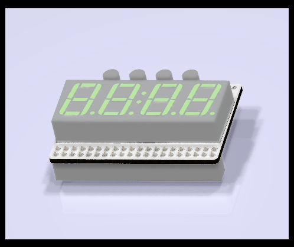

# 7-Segment LED Module for Pynq-Z2 RPi Header 

This is an add-on board designed for the Pynq-Z2 FPGA development board.
This is a 4-digit LED display using a single LDS-5461BK 7-segment display
module. This board avoids using the pins on the Pynq-Z2 RPi connector
which are shared with the PMOD A connector so that both can be used at the
same time.

This repo contains KiCAD files and Gerbers for those wanting to make their
own boards.  The board was auto-routed using FreeRouting.

This project is OSHW (Open Source Hardware), released under the GPLv3 license.

If you are interested in purchasing kits or complete modules, please contant
me at rob@mobilinkd.com.

