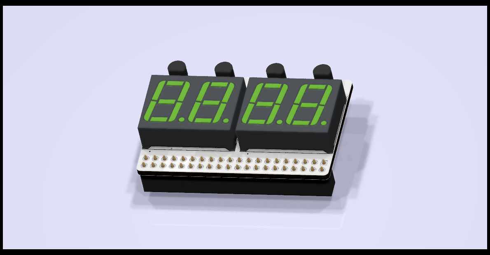

# 14-Segment LED Module for Pynq-Z2 RPi Header 

This is a board designed for the Pynq-Z2 FPGA development board.  This is a
4-digit LED display using Lite-On LTP-3784 14-segment display modules.  This
module avoids using the lines on thei Pynq-Z2 RPi connector which are shared
with the PMOD A connector, so that both can be used at the same time.

This repo contains KiCAD files and Gerbers for those wanting to make their
own boards.  The board was auto-routed using FreeRouting.

This project is OSHW (Open Source Hardware), released under the GPLv3 license.

* This rendering shows the board using 7-segment display modules.  This
is because I do not have a 3D model for a 14-segment display module.  This
board is designed to be used with 14-segment modules.

