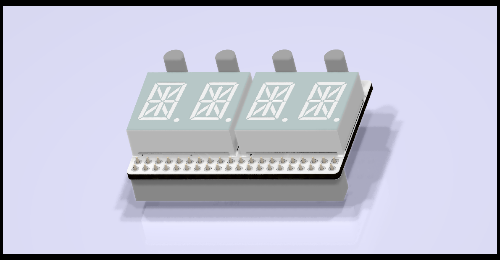

# Modules for Pynq-Z2

This repo contains modules for the TUL Pynq-Z2 board.

This repo was created for a single board, but morphed into a container
for multiple boards as the need for boards grew.

The boards in this repo are:

 1. A [14-segment LED module for the Raspberry Pi header](14-segment_led_module/README.md)
 1. A [7-segment LED module for the Raspberry Pi header](7-segment_led_module/README.md)
 1. A [8-segment LED bar graph module PMOD](bar-graph_led_pmod/README.md)
 1. A [8P DIP switch PMOD](dip_switch_pmod/README.md)
 
This repo contains KiCAD files and Gerbers for those wanting to make their
own boards.  These boards were all auto-routed using FreeRouting.

This project is OSHW (Open Source Hardware), released under the GPLv3 license.

If you are interested in purchasing kits or complete modules, please contant
me at rob@mobilinkd.com.

