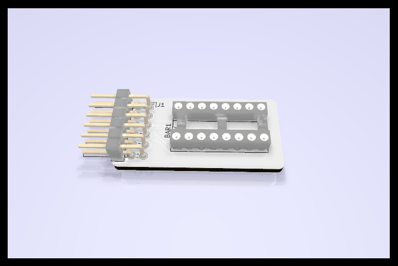

# 8-Segment Bar Graph LED PMOD

This is an add-on board designed for the Pynq-Z2 FPGA development board.
This is an 8-LED display using a B08SR 8-segment bar graph module. This board
expects that there are inline current limiting resistors on the PMOD signal
lines.  The LED segments are active low.

This repo contains KiCAD files and Gerbers for those wanting to make their
own boards.  The board was auto-routed using FreeRouting.

This project is OSHW (Open Source Hardware), released under the GPLv3 license.

If you are interested in purchasing kits or complete modules, please contant
me at rob@mobilinkd.com.

